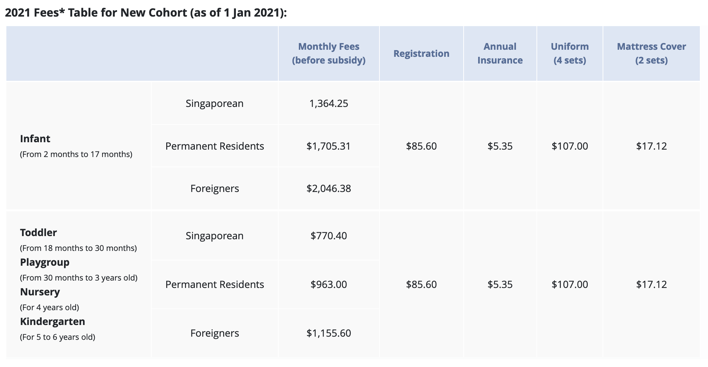

# work-in-singapore-guide

新加坡工作移民指南

### What is this guide for?

帮助你决定是否去新加坡工作 (Help you to decide if you want to work in Singapore). 这里假设你可以通过你的雇主获得EP工作签证，但是并没有拿到PR永久居留签证。

## 签证(Pass)

信息来源:
* [新加坡人力资源官网](https://www.mom.gov.sg)

### EP（Employment Pass）

这是你即将获得的签证类型，几个关键的[信息和数据](https://www.mom.gov.sg/passes-and-permits/employment-pass/key-facts):

| 签证有效期 | 家属签证  | 医疗保险 |
|------------|---|---|
|  首次2年 | 允许 | 由雇主决定 |

### DP（Dependant’s Pass）

这个签证主要用于你的配偶和子女，可以和EP签证一起申请，并且和EP一样，签证需要雇主协助申请。签证的有效期最长两年，同时和EP的有效期进行了绑定。特殊情况之下，幼稚园也能协助幼儿申请DP签证。

## 教育(Education)

信息来源:
* [新加坡教育局官网](https://www.moe.gov.sg)

### 学前班（preschool，年龄3岁之前）

新加坡教育局官网有[两家合作](https://www.moe.gov.sg/preschool/overview)的学前班教育机构，分别是[PCF Sparkletots](https://www.pcf.org.sg/sparkletots/)和[My First Skool](https://www.myfirstskool.com/early-years-centre), 两家教育机构的收费是一致的，同时两家机构都接受外国人的小孩教育申请，因此下面就以来自[My First Skool](https://www.myfirstskool.com/early-years-centre)的作为参考。

source: https://www.myfirstskool.com/infant-and-childcare

总结一下：作为外国居民，可以为幼儿申请学前教育培训，费用 约1200新币 (5700 RMB)/月

## 居住(Living)

信息来源:
* https://www.hdb.gov.sg

### 租房(Housing)

以[2021年的统计数据](https://www.hdb.gov.sg/cs/infoweb/residential/renting-a-flat/renting-from-the-open-market/rental-statistics)为例，最主要的出租房源类型为 3～4 个房间的房源，其中 3 个房间的租房价格区间为 1800 ～ 2100 新币，4 个房间的租房价格区间为 2000～2600 新币，不同区域之间价格有所差异。

下面列出了房屋的使用限制，以供参考

| Flat Type         | Maximum Number of tenants Allowed in Each Flat^  | Maximum Number of Bedroom(s) Allowed | Maximum Number of Occupants* Allowed in Each Flat^ |
|-------------------|:------------------------------------------------:|:------------------------------------:|:--------------------------------------------------:|
| 3-room            |                         6                        |                   1                  |                          6                         |
| 4-room and bigger |                         6                        |                   2                  |                          6                         |

个人觉得，如果有同行人员一起的话，合租还是最划算的一个选择。

### Q&A

1. 除了房租之外，还有那些隐藏的费用？
2. 3/4 rooms的公寓具体代表了什么？
3. 哪个区域租房性价比较高？

## 工作(Working)

信息来源:
* [新加坡金融部](https://www.mof.gov.sg/)
* [新加坡税务机构](https://www.iras.gov.sg/taxes/individual-income-tax/basics-of-individual-income-tax/tax-residency-and-tax-rates/individual-income-tax-rates)

### 个人所得税(Income Tax)

作为外国人，只要你在新加坡工作，那么你就得缴纳个人所得税。税收类型分为居民税（tax resident）和非居民税（tax non-resident）, 对于工作时长超过 183 天的员工来说，你需要参考的税率是居民税。正常来说，你需要缴纳的个人所得税比例应该在 7% 以内，对比中国有一定的优势。

[税收速算参考表](https://www.iras.gov.sg/taxes/individual-income-tax/basics-of-individual-income-tax/tax-residency-and-tax-rates/individual-income-tax-rates)

## 生活(Lifestyle)

### Q&A

1. 人均月消费情况如何？

## 去新加坡之后的生活(Life in Singapore)

这篇来自 [@winston](https://github.com/winston) 的[文章](https://github.com/rubysg/singapore)可以给你一个很清晰的概念，虽然文章可能略有过时，然仍然不失为一个很棒的参考。
